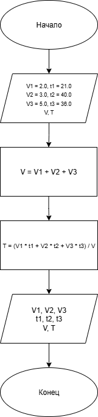

# Домашнее задание к работе 2
## Условия задачи
В первом сосуде содержится V1 литров воды температуры t1, во втором - V2 литров воды температуры t2, в третьем - V3 литров воды температуры t3. Воду слили в один сосуд. Найти объем и температуру воды в этом сосуде.

## 1. Алгоритм и блок-схема

### Алгоритм
1. **Начало**
2. Инициализировать переменные:
- `V1` (double) = 2, `t1` (double) = 21 — объем и температура воды в первом сосуде.

- `V2` (double) = 3, `t2` (double) = 40 — объем и температура воды во втором сосуде.

- `V3` (double) = 5, `t3` (double) = 36 — объем и температура воды в третьем сосуде.
- `V` (double) - общий объем. `T` (double) — общая температура.
3. Вычислить по формуле общий объем:
- `V` = V1 + V2 + V3
4. Вычислить по формуле температуру смеси:
- `T` = (V1 * t1 + V2 * t2 + V3 * t3) / V
5. Вывести результаты расчётов:
- Общий объем воды = `V`
- Температура смеси = `T`
6. **Конец**

### Блок-схема

https://github.com/Senya-Sidorov/Lab2/blob/main/lab2Bdiagram.png

## 2. Реализация программы

#include <stdio.h>
#include <locale.h>

void main() 
{
    setlocale(LC_ALL, "RUS");
    printf("Вариант 23\n");

    double V1 = 2.0, t1 = 21.0;   
    double V2 = 3.0, t2 = 40.0;   
    double V3 = 5.0, t3 = 36.0;   
    double V, T; // общий объем и температура смеси

    V = V1 + V2 + V3;
    T = (V1 * t1 + V2 * t2 + V3 * t3) / V;
    printf("\nОбъем первой порции воды: %.2f л, температура: %.2f\n", V1, t1);
    printf("Объем второй порции воды: %.2f л, температура: %.2f\n", V2, t2);
    printf("Объем третьей порции воды: %.2f л, температура: %.2f\n", V3, t3);

    printf("\nОбщий объем воды: %.2f литров\n", V);
    printf("Температура смеси: %.2f градусов\n", T);

    return 0;
}
